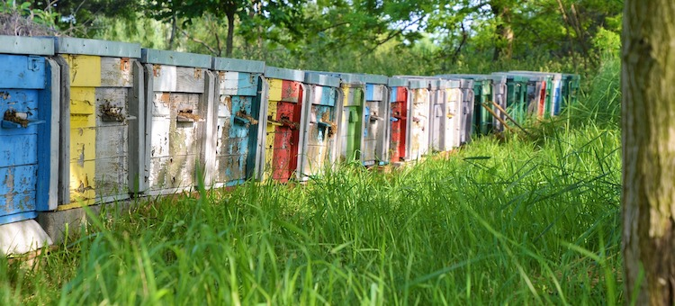
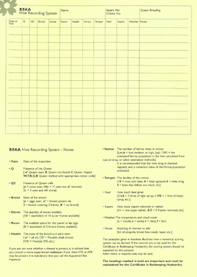
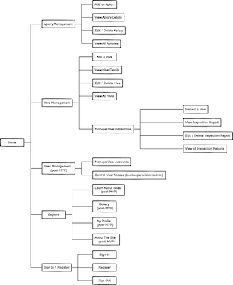
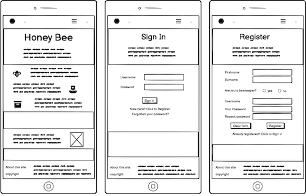
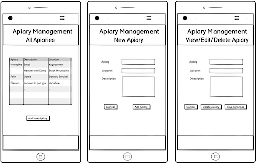
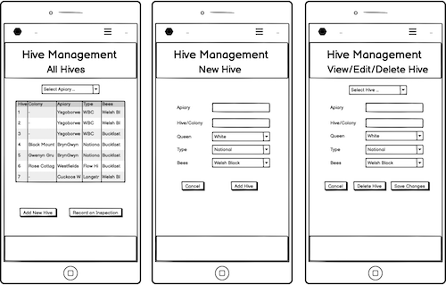
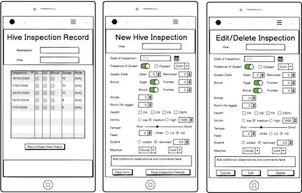

  

  <h1>Honey Bee</h1>

This repository and the accompanying interactive website is presented for Code Institute Milestone Project 3.

- - -

## Table of Contents

- [Introduction](#Introduction)
- [User Experience (UX)](#User-Experience-(UX))
  - [Project Goals](#Project-Goals)
  - [Strategy](#Strategy)
  - [Scope](#Scope)
  - [Structure](#Structure)
  - [Skeleton](#Skeleton)
  - [Surface](#Surface)
- [Site Functionality](#Site-Functionality)
- [Site Development](#Site-Development)
- [Testing](#Testing)
- [Guide to Deployment and Development](#Guide-to-Deployment-and-Development)
- [Project Review and Reflection](#Project-Review-and-Reflection)
- [Credits](#Credits)

- - -

  

## Introduction

This repository and the associated deployed website comprise my submission for the Diploma in Web Development, Milestone Project 3. 
The purpose of this project is to demonstrate ability to design and develop a database-backed web site, implemented using Flask and an appropriate database management system, with full CRUD (Create, Read, Update, Delete) functionality.

<kbd>[Return to ToC](#Table-of-Contents)</kbd>
- - -

  

## User Experience (UX)
The intended users of this web application are amateur beekeepers. 
In order to complete the British Beekeeping Association (BBKA) Certificate in Beekeeping Husbandry records need to be maintained of the checks carried out on every colony (hive). 
Although there is no standardised approach for inspection record keeping some data must be retained, such as data about colony health. Many variations and suggestions exist to help beekeepers in maintaining their records, with the BBKA suggesting their own [Hive Keeping Record Sheet](https://www.bbka.org.uk/bbka-hive-keeping-record-system). 

  
 
<em>Figure: BBKA Hive Recording System</em>

The aim of this application is to provide an online portal for beekeepers to maintain records of their colonies/hives and the apiaries in which they're located, plus a full digital record of every hive inspection. To this end the [BBKA Hive Keeping Record Sheet](https://www.bbka.org.uk/bbka-hive-keeping-record-system) has been used as the foundation for this hive inspection system.

### Project Goals
The primary goal of this project is to design, develop and deploy an interactive website for amateur beekeepers, for the recording and maintaining of apiary and hive data. In particular, this site needs to be usable when on location, and therefore should be designed taking a mobile-first approach.

### Strategy
<!-- What are we aiming to achieve, and for whom? -->
The target audience for this site are amateur beekeepers. It will support them in maintaining a record of all apiaries and hives/colonies, as well as providing an online form to be used for recording every hive inspection (undertaken weekly from spring to autumn).  
Due to the nature of hive inspections, being conducted on-site in the apiary, this web app is designed primary for use on mobile devices (i.e., smartphones/tablets). Hive inspections can therefore be recorded during the inspection process, or immediately after whilst sitting in the van with a flask of tea. 
It's expected that additional editing and viewing of report data is likely to then be done back at home/in the office.

### Scope
<!-- What features do we want to include in the design? What's on the table, and whats off (for now)? -->

The scope of this application focuses on the implementation of a record-keeping. This will implement full CRUD functionality for data about apiaries, hives and hive records.

The target audience for this application doesn't include professional bee farmers. These experienced professionals won't be aiming to complete the Certificate in Beekeeping Husbandry and will have more complex requirements for maintaining business records.

#### User Stories
The specific needs of the primary target users of this site, amateur beekeepers are outlines in the following user stories:

* As a Beekeeper I want to ...
  1. Be able to maintain a record of all of my apiaries (create, read, update & delete)
  2. Be able to maintain a record of all of my hives/colonies (create, read, update & delete)
  3. Record details of my weekly check of each hive, and save them for later use.
	4. View a full inspection report for each of my hives
	5. Have a registered account to secure access to my records

#### Outside Scope
Some elements considered in the current design will not be implemented due to being outside the scope described above. These include general information pages about honey bees and the beekeeping. 
Additional users and their user stories have been identified and are listed below. These have been flagged for future development as they fall outside the scope and requirements for Milestone Project 3.

Future User Stories

In order to support the design and implementation decisions made during this project additional user stories were considered for three additional users: Site Administrator, Mentor and Site Visitor. Additional user stories for the primary intended users, amateur beekeepers, have also been noted.
The following are outside scope for the first version of this site (as submitted for milestone project 3) but have been identified and noted to both demonstrate how this site will be developed post-MVP and to ensure that design/development decisions are made that will enable further development in future.

* As a Site Administrator I want to ...
  1. Maintain the accounts of registered site users.
  2. Be able to edit roles of registered users.

* As a Beekeeper I'd like to ...
	1. Have access to guidance regarding completing weekly check record.
  2. Be able to export hive records to PDF for printing and sharing with others, such as at local association meetings.
  3. Create a profile for advertising my work to the local community.
	4. Add images of my bees, with descriptions, to the site gallery to keep the local community informed about and engaged with my work.

* As a Mentor I'd like to ...
  1. Be able to view the hive data for each of my mentee's apiaries.
  2. Provide feedback on mentee's progress and management of their hives.

* As a Site Visitor I'd like to ...
  1. Learn more about honey bees and the local beekeepers.
  2. Browse gallery of images of local apiaries.
  3. Get recommendations for reputable sources of further information.
  4. Find contact details for local beekeepers who are able to remove swarms from my property.

### Structure
<!-- How is the information structured, and is it logically grouped? -->

  
 
<em>Figure: Site Map</em>

  
 
<em>Figure: MongoDB Data Schema</em>

The backend file structure, implementing the designs outlined above, was constructed according to the following design:

    - 📰 app.py               <-- Python application, using Flask
    - 📂 static               <-- Site files
        - 📂 css              
            - 📰 style.css    <-- CSS stylesheet 
        - 📂 img              <-- Folder containing all site images 
            - 📰 *.jpg
            - 📰 *.png
        - 📂 js
            - 📰 script.js    <-- JavaScript code for dynamic web-page functionality 
    - 📂 templates            <-- Site pages
        - 📰 base.html        <-- Base HTML page using Jinja templating
        - 📰 *.html 

*Figure : Design of site file structure*

### Skeleton
<!-- How the information should be implemented, and how the user will navigate through the info/features -->

#### Wireframes
Due to the primary aim of this site being a tool for beekeepers to use whilst on location, taking records whilst inspecting their bee colonies, the design focus has been on the mobile devices they will be using - smartphones and tablets. 
The user interface designs are separated into three groups: Apiary Management, Hive Management and Hive Inspections. In addition there are two pages for registered users - Registration and Sign In - and a Home page to welcome all site visitors.

  
 
<em>Figure: Home and User Pages</em>

  
 
<em>Figure: Apiary Management</em>

  
 
<em>Figure: Hive Management</em>

  
 
<em>Figure: Hive Inspection</em>

### Surface
<!-- What the product will actually look like, colors, typography, images, design elements, etc -->

#### Site Icons

#### Site Color Palette
The design intention was to select colors that are associated with bees, honey and nature.

#### Typography
Fonts used across the site were selected using the [Fontjoy](https://fontjoy.com/) font pairing suggestion site, where fonts pairings are suggested using AI/Deep Learning. The heading font ([Montserrat](https://fonts.google.com/specimen/Montserrat)) was selected first, then complementary body ([PT Sans](https://fonts.google.com/specimen/PT+Sans)) and supporting ([Karma](https://fonts.google.com/specimen/Karma)) fonts generated and selected that complement the heading font.

- - -

  

- - -

## Credits

### Site Media
- All images obtained from [Pixabay](https://pixabay.com/) are free to use under their [Content License](https://pixabay.com/service/license-summary/). The individual creators for these images are as follows:
  - image - [attribution](url)
  - 
- Google [fonts](https://fonts.google.com/) and [icons](https://fonts.google.com/icons) have been used across the site.

### Additional Code and Resources
- 
- Information badges at top of README created using [Shields.io](https://shields.io/)

### Learning Resources
- Development of the two project markdown files were supported through reference to the following three resources:
  - GitHub's [Writing on GitHub](https://docs.github.com/en/get-started/writing-on-github) documentation, 
  - Kera Cudmore's [Readme Examples](https://github.com/kera-cudmore/readme-examples/blob/main/milestone1-readme.md) for Code Institute Diploma Students,
  - Adam Pritchard's [Markdown Cheatsheet](https://github.com/adam-p/markdown-here/wiki/Markdown-Cheatsheet).

- General accessibility guidance was obtained from the [W3C ARIA guidelines](https://www.w3.org/WAI/ARIA/apg/).
- Guidance on ARIA roles and attributes obtained from [MDN](https://developer.mozilla.org/en-US/docs/Web/Accessibility/ARIA).

- The following resources were used to develop coding skills, in addition to the Code Institute learning materials:
    - Information on using Bootstrap 5 was obtained from both the [Bootstrap 5.3 documentation](https://getbootstrap.com/docs/5.3/) and [W3Schools Bootstrap 5 Tutorial](https://www.w3schools.com/bootstrap5/index.php).
    - [MongoDB Atlas](https://www.mongodb.com/docs/atlas/) documentation and the [MongoDB University](https://learn.mongodb.com/) free courses.
    - Guidance on how to handle application errors, resulting in the inclusion of error handling endpoint and error.html file, obtained from [Flask's documentation](https://flask.palletsprojects.com/en/2.3.x/)

- Guidance on using the three Lighthouse modes (user flows) was obtained from Google Chrome's [Lighthouse documentation](https://github.com/GoogleChrome/lighthouse/blob/HEAD/docs/user-flows.md).

### Inspiration
- 

### Acknowledgements
I would like to acknowledge the following people who helped me complete this milestone project:
- [Amy Richardson](https://code-institute-room.slack.com/team/U06CZC2JZTN) - our Code Institute cohort facilitator.
- [Jubril Akolade](https://github.com/Jubrillionaire) - my Code Institute mentor.
- The Code Institute Slack community, in particular my fellow students in the feb-2023-pla cohort. 
- My volunteer human testing and feedback team of Dr N Caine, Mr M Burgess.

<kbd>[Return to ToC](#Table-of-Contents)</kbd>

  

- - -
