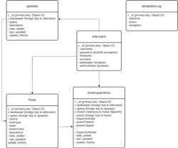

  

<h1 align="center">Honey Bee</h1>

 

 This repository and the accompanying interactive website is presented for Code Institute Milestone Project 3.

  <!-- GitHub Last Commit -->
  
  <!-- GitHub commit activity -->
  
  <!-- GitHub language count -->
  
  <!-- Website Status -->
  

- - -

    

[Visit the Honey Bee site at Heroku](https://mp3-honey-bee-be78d1a6d0c0.herokuapp.com/ "Honey Bee")

- - -

## Table of Contents

- [Introduction](#Introduction)
- [User Experience (UX)](#User-Experience-(UX))
  - [Project Goals](#Project-Goals)
  - [Strategy](#Strategy)
  - [Scope](#Scope)
  - [Structure](#Structure)
  - [Skeleton](#Skeleton)
  - [Surface](#Surface)
- [Site Functionality](#Site-Functionality)
- [Site Development](#Site-Development)
- [Testing](#Testing)
- [Guide to Deployment and Development](#Guide-to-Deployment-and-Development)
- [Project Review and Reflection](#Project-Review-and-Reflection)
- [Credits](#Credits)

- - -

  

## Introduction

This repository and the associated deployed website comprise my submission for the Diploma in Web Development, Milestone Project 3. 
The purpose of this project is to demonstrate ability to design and develop a database-backed web site, implemented using Flask and an appropriate database management system, with full CRUD (Create, Read, Update, Delete) functionality.

<kbd>[Return to ToC](#Table-of-Contents)</kbd>
- - -

  

## User Experience (UX)

The intended users of this web application are amateur beekeepers. 
In order to complete the British Beekeeping Association (BBKA) Certificate in Beekeeping Husbandry records need to be maintained of the checks carried out on every colony (hive). 
Although there is no standardised approach for inspection record keeping some data must be retained, such as data about colony health. Many variations and suggestions exist to help beekeepers in maintaining their records, with the BBKA suggesting their own [Hive Keeping Record Sheet](https://www.bbka.org.uk/bbka-hive-keeping-record-system "BBKA Hive Keeping Record Sheet"). 

  
 
<em>Figure: BBKA Hive Recording System</em>

The aim of this application is to provide an online portal for beekeepers to maintain records of their colonies/hives and the apiaries in which they're located, plus a full digital record of every hive inspection. To this end the [BBKA Hive Keeping Record Sheet](https://www.bbka.org.uk/bbka-hive-keeping-record-system "BBKA Hive Keeping Record Sheet") has been used as the foundation for this hive inspection system.

### Project Goals
The primary goal of this project is to design, develop and deploy an interactive website for amateur beekeepers, for the recording and maintaining of apiary and hive data. In particular, this site needs to be usable when on location, and therefore should be designed taking a mobile-first approach.

### Strategy
<!-- What are we aiming to achieve, and for whom? -->
The target audience for this site are amateur beekeepers. It will support them in maintaining a record of all apiaries and hives/colonies, as well as providing an online form to be used for recording every hive inspection (undertaken weekly from spring to autumn).  
Due to the nature of hive inspections, being conducted on-site in the apiary, this web app is designed primary for use on mobile devices (i.e., smartphones/tablets). Hive inspections can therefore be recorded during the inspection process, or immediately after whilst sitting in the van with a flask of tea. 
It's expected that additional editing and viewing of report data is likely to then be done back at home/in the office.

### Scope
<!-- What features do we want to include in the design? What's on the table, and whats off (for now)? -->
The scope of this application focuses on the implementation of a record-keeping. This will implement full CRUD functionality for data about apiaries, hives and hive records.

The target audience for this application doesn't include professional bee farmers. These experienced professionals won't be aiming to complete the Certificate in Beekeeping Husbandry and will have more complex requirements for maintaining business records.

#### User Stories
The specific needs of the primary target users of this site, amateur beekeepers are outlines in the following user stories:

* As a Beekeeper I want to ...
  1. Be able to maintain a record of all of my apiaries (create, read, update & delete)
  2. Be able to maintain a record of all of my hives/colonies (create, read, update & delete)
  3. Record details of my weekly check of each hive, and save them for later use.
	4. View a full inspection report for each of my hives
	5. Have a registered account to secure access to my records

#### Outside Scope
Some elements considered in the current design will not be implemented due to being outside the scope described above. These include general information pages about honey bees and the beekeeping. 
Additional users and their user stories have been identified and are listed below. These have been flagged for future development as they fall outside the scope and requirements for Milestone Project 3.

Future User Stories (click to expand)

In order to support the design and implementation decisions made during this project additional user stories were considered for three additional users: Site Administrator, Mentor and Site Visitor. Additional user stories for the primary intended users, amateur beekeepers, have also been noted.
The following are outside scope for the first version of this site (as submitted for milestone project 3) but have been identified and noted to both demonstrate how this site will be developed post-MVP and to ensure that design/development decisions are made that will enable further development in future.

* As a Site Administrator I want to ...
  1. Be able to manage the accounts of registered site users.
  2. View edit history of apiary and beehive edits, in case of audits.

* As a Beekeeper I'd like to ...
	1. Be able to more effectively track health concerns across my apiaries (FB, Varroa, etc), to facilitate reporting to [BeeBase](https://www.nationalbeeunit.com/).
  2. Be able to export hive records to PDF for printing and sharing with others, such as at local association meetings.
  3. Be able to review data edit history in case of auditing.
  4. Create a profile for advertising my work to the local community.
	5. Add images of my bees, with descriptions, to the site gallery to keep the local community informed about and engaged with my work.

* As a Mentor I'd like to ...
  1. Be able to view the hive data for each of my mentee's apiaries.
  2. Provide feedback on mentee's progress and management of their hives.

* As a Site Visitor I'd like to ...
  1. Learn more about honey bees and the local beekeepers.
  2. Browse gallery of images of local apiaries.
  3. Get recommendations for reputable sources of further information.
  4. Find contact details for local beekeepers who are able to remove swarms from my property.

### Structure
<!-- How is the information structured, and is it logically grouped? -->
The site structure according to functionality groupings (not strictly mapped to site pages) is shown in the Site Map figure. At the backend all data will be stored online using MongoDB. The structure of the backend database is illustrated in the MongoDB Database Schema figure.

  
 
<em>Figure: Site Map</em>

  
 
<em>Figure: MongoDB Database Schema</em>

The backend file structure, implementing the designs outlined above, was constructed according to the following design:

    - 📰 app.py               <-- Python application, using Flask
    - 📂 static               <-- Site files
        - 📂 css              
            - 📰 style.css    <-- CSS stylesheet 
        - 📂 img              <-- Folder containing all site images 
            - 📰 *.jpg
            - 📰 *.png
        - 📂 js
            - 📰 script.js    <-- JavaScript code for dynamic web-page functionality 
    - 📂 templates            <-- Site pages
        - 📰 base.html        <-- Base HTML page using Jinja templating
        - 📰 *.html 
    - 📂 docs                 <-- Location of project documentation files

*Figure : Design of site file structure*

### Skeleton
<!-- How the information should be implemented, and how the user will navigate through the info/features -->

Honey Bee will be constructed using a `base` template file, and populated with data from other html files according to application endpoints defined in flask and content population using the Jinja templating framework. From the perspective of the site visitor however it will appear to be comprised of a number of distinct pages:

- Home / Welcome Page
- Sign in and Registration Pages
- Apiary Pages: View all apiaries, add apiary, edit apiary, delete apiary
- Hive Pages: View all hives, add hive, edit hive, delete hive
- Hive Inspection Pages: View all inspection reports per hive, add inspection report, edit inspection report, delete inspection report.
- Learn About Bees Page (draft content only)
- A placeholder page for as-yet unimplemented content (included for illustration, although in practice all unimplemented functionality would be hidden from site visitors).
- plus, for the unfortunate visitor, and error page informing them when something goes wrong.

#### Error Handling

Error handling will be provided throughout to ensure that user engagement is not interrupted by functional or runtime errors (or at least minimised). This error handling will be implemented as follows:

- Failed Operations
Flask's [flash messages](https://flask.palletsprojects.com/en/2.3.x/patterns/flashing/ "Message Flashing in Flask") will be employed throughout the site. These will keep the site user informed of backend functionality, informing them when events occur 'behind the scenes'. Users will mostly see messages relating to successful operations (successful login, data update or deletion, etc). Flash messages will also be used when an error occurs, such as when data cannot be located in the database, when a data update fails, and so on. 
In addition to flash messages, every failed operation will be logged in the database for later review.

- Application Exceptions
When an exception is raised by the application an error page will be displayed including details of the error that occurred. This is included to ensure the application doesn't 'crash' but informs the user of events that have occurred. In order to handle such exceptions the site will employ the [Flash errorhandler endpoint](https://flask.palletsprojects.com/en/2.3.x/errorhandling/ "Flash Error Handling"). 

- Out of Scope Functionality
Until all future functionality is completed, some elements of the site will not be active. Although these are outside the scope of this project, these may cause an issue to visitors of the initial site. As such, where a page is not yet available in the site the page `placeholder.html` will inform the visitor that the functionality has not yet been implemented.

#### Wireframes
Due to the primary aim of this site being a tool for beekeepers to use whilst on location, taking records whilst inspecting their bee colonies, the design focus has been on the mobile devices they will be using - smartphones and tablets. 
The user interface designs are separated into three groups: Apiary Management, Hive Management and Hive Inspections. In addition there are two pages for registered users - Registration and Sign In - and a Home page to welcome all site visitors.

  
 
<em>Figure: Home and User Pages</em>

  
 
<em>Figure: Apiary Management</em>

  
 
<em>Figure: Hive Management</em>

  
 
<em>Figure: Hive Inspection</em>

### Surface
<!-- What the product will actually look like, colors, typography, images, design elements, etc -->
The surface design decisions were made ono consideration of keeping the interface simple, intuitive, with colors associated with nature and bees

#### Site Icons
All icons across the site are from Google's font library. These [Material Symbols and Icons](https://fonts.google.com/icons "Material Symbols and Icons") have ben selected to align most closely with the topic to which they're attached (such as a hive or bee) or familiarity to users (sign in and out, information and edit, cancel, etc). 

#### Site Color Palette
The design intention was to select colors that are associated with bees, honey and nature.

Having selected a honey-yellow color this was entered into the online palette generator from [ColorSpace](https://mycolor.space/?hex=%23FFD340&sub=1 "Color palette suggestions") in order to generate suggested palette options. Picking a potential contracting color for site font text, [Adobe's Color Contrast Analyzer](https://color.adobe.com/create/color-contrast-analyzer "Color Contrast Analyzer") was used to tweak the color match to ensure the site is accessible to a wider audience of users.

  
 
<em>Figure: Color contrast checker from <a href="https://color.adobe.com/create/color-contrast-analyzer" target="_blank">Adobe Accessibility Tools</a></em>

#### Typography
Fonts used across the site were chosen using the [Fontjoy](https://fontjoy.com/ "Fontjoy - Font suggestions using Deep Learning") font pairing suggestion site, where fonts pairings are suggested using AI/Deep Learning. The heading font ([Montserrat](https://fonts.google.com/specimen/Montserrat "Montserrat @ Google Fonts")) was selected first due to it's clear structure being easily visible on small viewports. The complementary body ([PT Sans](https://fonts.google.com/specimen/PT+Sans "PT Sans @ Google Fonts")) and supporting ([Karma](https://fonts.google.com/specimen/Karma "Karma @ Google Fonts")) fonts generated were selected based on those I felt complemented the heading font.

  
 
<em>Figure: Final font selection in <a href="https://fontjoy.com/" target="_blank">Fontjoy</a></em>

#### Site Images
All images used across Honey Bee were chosen from Pixabay from their royalty free library.

#### Accessibility
Site accessibility was considered throughout the design, development and testing process. This was guided by [W3C ARIA guidelines](https://www.w3.org/WAI/ARIA/apg/ "ARIA Guidelines") and [MDN](https://developer.mozilla.org/en-US/docs/Web/Accessibility/ARIA "ARIA Guidelines").

<kbd>[Return to ToC](#Table-of-Contents)</kbd>

- - -

  

# Site Functionality

<kbd>[Return to ToC](#Table-of-Contents)</kbd>

- - -

  

# Site Development

## Technologies

**Markup Languages**
- [HTML](https://www.w3schools.com/html/html_intro.asp "HTML Introduction, W3Schools"): The standard web page markup language for constructing static web pages.
- [Markdown](https://en.wikipedia.org/wiki/Markdown "Markdown overview, Wikipedia"): Use to produce project documentation, including this README.

**Coding**
- [Python](https://www.python.org/ "Python.org"): The Python programming language was used to provide the majority of the backend functionality.   
- [Flask](https://flask.palletsprojects.com/en/3.0.x/ "lask Microframework"): The Flask micro web framework was used to provide a web routing functionality.
- [Jinja](https://jinja.palletsprojects.com/en/3.1.x/ "Jinja Templating Engine"): This templating language was used to enable dynamic data modifications in the web application from Python and Flask.
- [Werkzeug](https://werkzeug.palletsprojects.com/en/3.0.x/ "Werkzeug Application Library"): The *security* and *exceptions* modules of Werkzeug were employed to provide password encryption and route exception handling respectively to the web application.
- [JavaScript](https://www.w3schools.com/js/js_intro.asp "JavaScript Introduction, W3Schools") & [jQuery](https://jquery.com/ "jQuery"): These were used to add additional functionality to the site, primarily for modifying the status of elements within HTML pages, 

**Styling**
- [Bootstrap 5.3](https://getbootstrap.com/ "Bootstrap"): The Bootstrap toolkit was used for site layout and styling. 
- [CSS](https://www.w3schools.com/css/css_intro.asp "CSS Introduction, W3Schools"): Additional styling was added to the site using CSS.

## Data Management

The backend functionality of this web application is underpinned by [MongoDB](https://www.mongodb.com/ "MongoDB").

This NoSQL database management system (DBMS) was chosen, primarily, for the following three reasons.
  1. The database schema for this initial version of the web application isn't overly complex and is relatively static. Future developments would however require schema flexibility for efficient storing of profile data, images, and other unstructured data.
  2. The flexibility of a MongoDB schema allows for maintaining a (short) record of each database update for each item in each collection, thus maintaining a history of edits. The current approach includes appending each update to an `update-history` array, currently in the form of  a dictionary containing a datetime stamp and comment. Storing this expanding array of dictionaries would not be possible in a relational database without breaking one of the key requirements for first normal form, where each attribute should be atomic.

  
 
<em>Figure: Sample apiary record from the project database, illustrating update history</a></em>

  3. Although relationships and referential integrity can be enforced, the approach to this is flexible and can be controlled by the application developer. This allows for more flexibility in developing this application such as allowing for future intended developments where an administrator can maintain records for apiaries that are no longer managed by a beekeeper. In a relational database breaking the relationship between beekeeper and apiary (or hive) would undermine referential integrity. This is not an issue however within a NoSQL schema.
  

## Tools
This section lists the tools used during this project in support of the development and deployment stages.
- VS Code: All code was developed using a local installation of VS Code. (Code Institute development tools were not used during this project)
- [Google Chrome Developer Tools](https://developer.chrome.com/docs/devtools "DevTools"): Used throughout development to support page design, testing and accessibility. 
- Git & GitHub: Git used for version control, with GitHub being employed as the online repository for all project work.
- [Heroku](https://www.heroku.com/ "Heroku"): The Heroku platform has been used in this project to host the final, [deployed web site](https://mp3-honey-bee-be78d1a6d0c0.herokuapp.com/ "Honey Bee"). 

<kbd>[Return to ToC](#Table-of-Contents)</kbd>

- - -

# Testing

Full overview and results of site testing can be found in [TESTING.MD](docs/TESTING.md).

<kbd>[Return to ToC](#Table-of-Contents)</kbd>

- - -

# Guide to Deployment and Development

Guidance for how to use the project repository for deploying the site or for undertaking further local development can be found in [DEPLOYMENT.MD](docs/DEPLOYMENT.md).

<kbd>[Return to ToC](#Table-of-Contents)</kbd>

- - -

  

## Project Review and Reflection

### Improvements to Design and Development

#### Defensive programming
Currently the user is able to edit and delete data and is notified of success via flash messaging. However, functionality could be improved by adopting a more defensive approach to coding by including checks, asking users to actively confirm deletions and edits.

#### Automated Testing
Manual testing was undertaken before project completion. However, this process could be improved and the site more robust through the inclusion of automated testing.

#### Site Security
Site currently relies on HTTP. Future development should include upgrading this to HTTPS.

### Future Features
Aside from implementing the Future User Stories listed above, the site could be improved by undertaking some additional work on this current version. The initial improvements are listed in this section.

#### Additional User Guidance
Including popovers or tooltips would help users. In particular, including these on the hive inspection would be beneficial for new beekeepers who will have a lot to learn and handle out in the field. Providing guidance during inspections would support them in skill development and confidence growth.
These popovers/tooltips would be an optional feature that could be turned off once no longer required.

#### Text truncation
Some areas of the site have the potential to become crowded by text. Description table columns in particular could potentially contain more text than fits comfortably on a small screen. In future text would be truncated according to standard breakpoints.

<kbd>[Return to ToC](#Table-of-Contents)</kbd>

- - -

## Credits

### Site Media
- All images obtained from [Pixabay](https://pixabay.com/) are free to use under their [Content License](https://pixabay.com/service/license-summary/).
- Google [fonts](https://fonts.google.com/) and [icons](https://fonts.google.com/icons) have been used across the site.

### Additional Code and Resources
- Exception handling code was adapted from the [Flash errorhandler endpoint](https://flask.palletsprojects.com/en/2.3.x/errorhandling/ "Flash Error Handling") example code.
- Inspiration for site button styling was taken from [CSS Scan](https://getcssscan.com/css-buttons-examples). 
- Information badges at top of README created using [Shields.io](https://shields.io/)

### Learning Resources
- Development of the two project markdown files were supported through reference to the following resources:
  - GitHub's [Writing on GitHub](https://docs.github.com/en/get-started/writing-on-github) documentation, 
  - Kera Cudmore's [Readme Examples](https://github.com/kera-cudmore/readme-examples/blob/main/milestone1-readme.md) for Code Institute Diploma Students,
  - Adam Pritchard's [Markdown Cheatsheet](https://github.com/adam-p/markdown-here/wiki/Markdown-Cheatsheet).

- General accessibility guidance was obtained from the [W3C ARIA guidelines](https://www.w3.org/WAI/ARIA/apg/).
- Guidance on ARIA roles and descriptions obtained from [MDN](https://developer.mozilla.org/en-US/docs/Web/Accessibility/ARIA).

- The following resources were used to develop coding skills, in addition to the Code Institute learning materials:
    - Information on using Bootstrap 5 was obtained from both the [Bootstrap 5.3 documentation](https://getbootstrap.com/docs/5.3/) and [W3Schools Bootstrap 5 Tutorial](https://www.w3schools.com/bootstrap5/index.php).
    - [MongoDB Atlas](https://www.mongodb.com/docs/atlas/) documentation and the [MongoDB University](https://learn.mongodb.com/) free courses.
    - Guidance on how to handle application errors, resulting in the inclusion of error handling endpoint and error.html file, obtained from [Flask's documentation](https://flask.palletsprojects.com/en/2.3.x/)
- Guidance on using the three Lighthouse modes (user flows) was obtained from Google Chrome's [Lighthouse documentation](https://github.com/GoogleChrome/lighthouse/blob/HEAD/docs/user-flows.md).

### Inspiration
- Inspiration for the Hive Inspection Form was taken from the [British Beekeeping Association (BBKA) Hive Keeping Record Sheet](https://www.bbka.org.uk/bbka-hive-keeping-record-systemn "BBKA"), my need to maintain such records as a new beekeeper and not being able to find a simple-to-use digital system for recording this data.

### Acknowledgements
I would like to acknowledge the following people who helped me complete this milestone project:
- [Amy Richardson](https://code-institute-room.slack.com/team/U06CZC2JZTN) - our Code Institute cohort facilitator.
- [Jubril Akolade](https://github.com/Jubrillionaire) - my Code Institute mentor.
- The Code Institute Slack community, in particular my fellow students in the feb-2023-pla cohort. 
- My volunteer human testing and feedback team of Dr N Caine, Mr M Burgess.

  

<kbd>[Return to ToC](#Table-of-Contents)</kbd>

- - -

