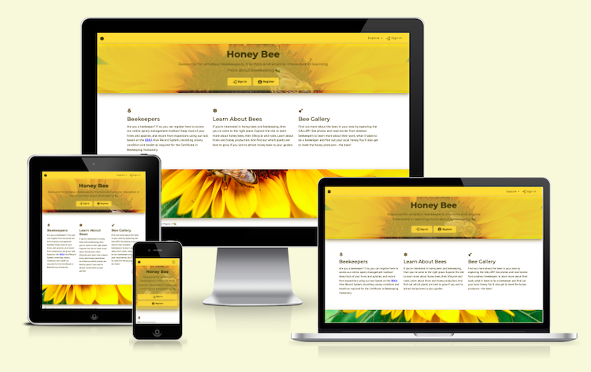

  

<h1 align="center">Testing Honey Bee</h1>

Overview of the testing of Milestone Project 3 - Honey Bee.

    

## Table of Contents

   - [Introduction](#Introduction)
   - [Browser Compatibility](#Browser-Compatibility)
   - [Site Responsiveness](#Site-Responsiveness)
   - [Code Validation](#Code-Validation)
   - [Lighthouse Testing](#Lighthouse-Testing)
   - [User Stories](#User-Stories)
   - [Features](#Features)
   - [Bugs and Issues](#Bugs-and-Issues)

- - -

## Introduction
This document describes the testing process and results for Milestone Project 2. For additional project details please refer to:
- [Main project README document](../../README.md)
- [Deployed web site](https://mp3-honey-bee-be78d1a6d0c0.herokuapp.com/)

<kbd>[Return to ToC](#Table-of-Contents)</kbd>
- - -

## Browser Compatibility
Browser compatibility testing was completed with Chrome, Firefox, Safari and Opera, running on a MacBook. Edge and IE were not tested at this stage due to lack of access to those browsers. Before professional site deployment, compatibility would need to be tested on Windows-specific and a selection of mobile-specific browsers.

*Table 1: Browser responsiveness test results*

| | CHROME | FIREFOX | SAFARI | OPERA | Notes | 
| ----------- | ----------- | ----------- | ----------- | ----------- | ----------- 
| Intended appearance? | [x] | [x] | [x] | [x] | No issues identified |
| Intended responsiveness? | [x] | [x] | [x] | [x] | No issues identified |

Results of the testing undertaken on each browser can also be seen in the following folders: [Chrome](browsers/chrome/), [Firefox](browsers/firefox/), [Safari](browsers/safari/), [Opera](browsers/opera/).

<kbd>[Return to ToC](#Table-of-Contents)</kbd>
- - -

## Site Responsiveness
Responsiveness tests were undertaken using Google Chrome DevTools and the online tools [Responsive Design Checker](https://responsivedesignchecker.com/) and [AmIResponsive](https://ui.dev/amiresponsive). All tests were conducted using a MacBook. 

    
     
    <em>Figure: Result of running 'Honey Bee' through <a href="https://ui.dev/amiresponsive" target="_blank">AmIResponsive</a></em>

Due to lack of access to multiple devices, all device responsiveness tests were completed using the [Google Chrome DevTools simulation tool](https://developer.chrome.com/docs/devtools/device-mode/). Before professional site deployment, responsiveness would need to be tested on real devices.

- - -

## Lighthouse Testing

## User Stories
To validate the achievement of original goals for this MP3 web application, the table below revisits every user story and reviews how each is achieved.

| *USER STORY* | *Achieved?* | *VALIDATION* |
| ----------- | ----------- | ----------- |
| *1. Be able to maintain a record of all of my apiaries:* | - | complete |
| i. create apiary record | [x] | <a href="images/walkthrough/10-apiary-newentry.png" target="_blank">Add New Apiary</a> <a href="images/walkthrough/12-apiary-record.png" target="_blank">Database Record</a> |
| ii. read (view) apiary record | [x] | <a href="images/walkthrough/13-apiary-view.png" target="_blank">View Apiary Record</a> |
| iii. update apiary record | [x] | <a href="images/walkthrough/14-apiary-update.png" target="_blank">Update Apiary Record</a> <a href="images/walkthrough/15-apiary-updatesuccess.png" target="_blank">Update Successful </a> |
| iv. delete apiary record | [x] | <a href="images/walkthrough/16-apiary-deletion.png" target="_blank">Apiary Deleted</a> |
| v. view all apiary records | [x] | <a href="images/walkthrough/11-apiary-list.png" target="_blank">List of apiaries</a> |
| *2. Be able to maintain a record of all of my hives/colonies:* | - | complete |
| i. create hive record | [x] | <a href="images/walkthrough/20-hive-newhive.png" target="_blank">Add New Hive</a> |
| ii. read (view) hive record | [x] | <a href="images/walkthrough/22-hive-view.png" target="_blank">View Hive Record</a> |
| iii. update hive record | [x] | <a href="images/walkthrough/23-hive-update.png" target="_blank">Update Hive Record</a> <a href="images/walkthrough/24-hive-updatesuccess.png" target="_blank">Update Successful </a> <a href="images/walkthrough/24-hive-updatesuccess.png" target="_blank">Updated Database Record </a> |
| iv. delete hive record | [x] | <a href="images/walkthrough/26-hive-delete.png" target="_blank">Hive Deleted</a> |
| v. view all hive records | [x] | <a href="images/walkthrough/21-hive-list.png" target="_blank">List of hives</a> |
| *3. Record details of my weekly hive inspections, and save them for later use* | _ | complete |
| i. create hive inspection record | [x] | <a href="images/walkthrough/32-hive-inspectionformfilled.png" target="_blank">New Inspection Record</a> <a href="images/walkthrough/33-hive-inspectionsaved.png" target="_blank">Inspection Saved</a> |
| ii. read (view) inspection record | [x] | <a href="images/walkthrough/35-hive-inspection-record.png" target="_blank">View Inspection Record</a> |
| iii. update inspection record | [ ] | <a href="#" target="_blank">Update Inspection Record</a> <a href="#" target="_blank">Update Successful</a> |
| iv. delete inspection record | [x] | <a href="#" target="_blank">Inspection Deleted</a> |
| v. view all inspection records | [x] | <a href="images/walkthrough/34-hive-inspectionlist.png" target="_blank">List of Inspection Records</a> |
| *4. Have a registered account to secure access to my records* | - | complete |
| i. create account | [x] | <a href="images/walkthrough/05-register-complete.png" target="_blank">Register</a> <a href="images/walkthrough/06-register-success.png" target="_blank">Success</a> |
| ii. sign in to account | [x] | <a href="images/walkthrough/07-signin.png" target="_blank">Sign In</a> <a href="images/walkthrough/08-signedin.png" target="_blank">Signed In</a> <a href="images/walkthrough/07-signin.png" target="_blank">Sign In</a>|
| ii. sign in to account | [x] | <a href="images/walkthrough/07-signin.png" target="_blank">Sign In</a> <a href="images/walkthrough/08-signedin.png" target="_blank">Signed In</a> <a href="images/walkthrough/09-registered-users.png" target="_blank">Registered users in database</a>|

*Table: User Story Validation*

## Features
All site features have been manually tested. The results of these tests are shown in the tables below:

| Page | Feature | Expected Outcome | Action | Result | Pass/Fail | 
| :---: | ------- | ------- | ------- | ------- | :-----: |
| Home | '*Sign In*' button | Clicking the '*Sign In*' button will take the user to a page to sign into their account | Click the '*Sign In*' button | Sign In page is displayed | Pass | 
|  |  |  |  |  |  |

|  |  |  |  |  |  |
|  |  |  |  |  |  |
|  |  |  |  |  |  |
|  |  |  |  |  |  |
|  |  |  |  |  |  |
|  |  |  |  |  |  |
|  |  |  |  |  |  |
|  |  |  |  |  |  |
|  |  |  |  |  |  |
|  |  |  |  |  |  |

*Table: Result of feature tests*

<kbd>[Return to ToC](#Table-of-Contents)</kbd>

- - -

| .. | Results |
| --- | --- | 
| | <ul><li>- [x] completed</li></ul> | 
| | <ul><li>- [ ] completed</li></ul> | 
