

  

<h1 align="center">Testing Honey Bee</h1>

> Overview of Web Application Testing

This document provides an overview of the testing of Milestone Project 3 - the Honey Bee web application project.

- - -

## Table of Contents

   - [Introduction](#Introduction)
   - [Browser Compatibility](#Browser-Compatibility)
   - [Site Responsiveness](#Site-Responsiveness)
   - [Code Validation](#Code-Validation)
   - [Lighthouse Testing](#Lighthouse-Testing)
   - [User Stories](#User-Stories)
   - [Features](#Features)
   - [Issues](#Issues)

- - -

## Introduction
This document describes the testing process and results for Milestone Project 2. For additional project details please refer to:
- [Main project README document](../../README.md)
- [Deployed web site](https://mp3-honey-bee-be78d1a6d0c0.herokuapp.com/)

<kbd>[Return to ToC](#Table-of-Contents)</kbd>
- - -

## Browser Compatibility
Browser compatibility testing was completed with Chrome, Firefox, Safari and Opera, running on a MacBook. Edge and IE were not tested at this stage due to lack of access to those browsers. Before professional site deployment, compatibility would need to be tested on Windows-specific and a selection of mobile-specific browsers.

*Table 1: Browser responsiveness test results*

| | CHROME | FIREFOX | SAFARI | OPERA | Notes | 
| ----------- | ----------- | ----------- | ----------- | ----------- | ----------- 
| Intended appearance? | [x] | [x] | [x] | [x] | No issues identified |
| Intended responsiveness? | [x] | [x] | [x] | [x] | No issues identified |

<kbd>[Return to ToC](#Table-of-Contents)</kbd>

- - -

## Site Responsiveness
Responsiveness tests were undertaken using Google Chrome DevTools and the online tools [Responsive Design Checker](https://responsivedesignchecker.com/) and [AmIResponsive](https://ui.dev/amiresponsive). All tests were conducted using a MacBook. 

    
     
    <em>Figure: Result of running 'Honey Bee' through <a href="https://ui.dev/amiresponsive" target="_blank">AmIResponsive</a></em>

Due to lack of access to multiple devices, all device responsiveness tests were completed using the [Google Chrome DevTools simulation tool](https://developer.chrome.com/docs/devtools/device-mode/). Before professional site deployment, responsiveness would need to be tested on real devices.

<kbd>[Return to ToC](#Table-of-Contents)</kbd>

- - -

## Code Validation

### Python

Python file `app.py` was validated using the [Code Institute Python Linter](https://pep8ci.herokuapp.com/).

  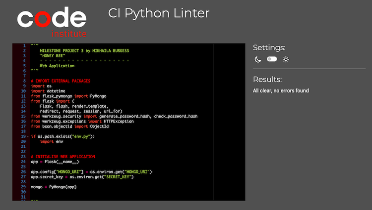
 
<em>Figure: CI Python Linter Result</em>

No issues identified.

### JavaScript

JavaScript file `script.js` was validated using [JSHint v2.13](https://jshint.com/). 

  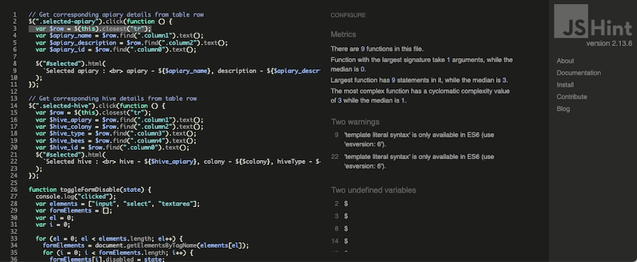
 
<em>Figure: JavaScript Validation Result</em>

JSHint highlighted some undefined variables and unused functions. These were due to them being used/accessed from within the HTML pages rather than within the script itself. There were no other issues.

### CSS Validation

The [W3C Jigsaw Validation Service](https://jigsaw.w3.org/css-validator/#validate_by_input) was used to check project CSS (using the 'direct input' option).

  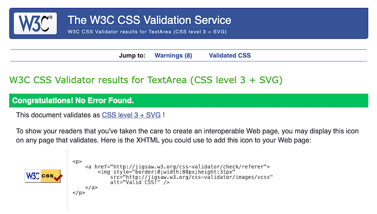
 
<em>Figure: CSS Validation Result</em>

No errors were raised. 
8 warnings were flagged relating to reference to vendor toolkits, which had been included in addition to non-vendor specific code to support broader access. These are therefore of no concern.

<kbd>[Return to ToC](#Table-of-Contents)</kbd>

- - -

## Lighthouse Testing
The [Lighthouse](https://developer.chrome.com/docs/lighthouse/overview/) tool in Google Chrome was used to test site performance, accessibility and best practice.

| *PAGE* | *RESULT* | *REPORT* |
| :--- | :---: | :---: |
| Home page |  | [pdf](testing/lighthouse-reports/lighthouse-home-page.pdf) |
| View Apiaries | 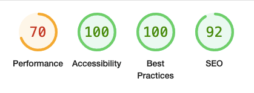 | [pdf](testing/lighthouse-reports/lighthouse-apiary-table.pdf) |
| View Hives | 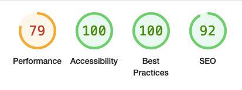 | [pdf](testing/lighthouse-reports/lighthouse-hive-table.pdf) |
| View Hive Inspections | 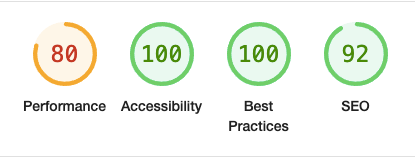 | [pdf](testing/lighthouse-reports/lighthouse-inspection-table.pdf) |
| Record a Hive Inspection | 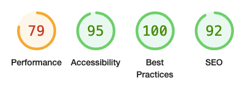 | [pdf](testing/lighthouse-reports/lighthouse-record-inspection.pdf) |
| View a Inspection Report | 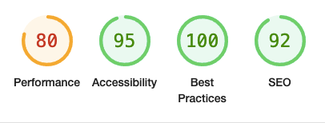 | [pdf](testing/lighthouse-reports/lighthouse-view-inspection.pdf) |
| Learn About Bees | 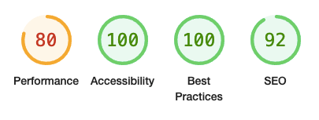 | [pdf](testing/lighthouse-reports/lighthouse-learn-about-bees.pdf) |
| About Honey Bee | 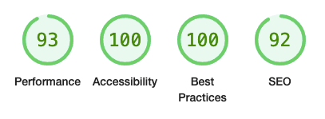 | [pdf](testing/lighthouse-reports/lighthouse-about-page.pdf) |

*Table: Summary of Lighthouse Testing Results*

<kbd>[Return to ToC](#Table-of-Contents)</kbd>

- - -

## User Stories
To validate the achievement of original goals for this MP3 web application, the table below revisits every user story and reviews how each is achieved.

| *USER STORY* | *Achieved?* | *VALIDATION* |
| ----------- | ----------- | ----------- |
| *1. Be able to maintain a record of all of my apiaries:* | - | complete |
| i. create apiary record | [x] | <a href="images/walkthrough/10-apiary-newentry.png" target="_blank">Add New Apiary</a> <a href="images/walkthrough/12-apiary-record.png" target="_blank">Database Record</a> |
| ii. read (view) apiary record | [x] | <a href="images/walkthrough/13-apiary-view.png" target="_blank">View Apiary Record</a> |
| iii. update apiary record | [x] | <a href="images/walkthrough/14-apiary-update.png" target="_blank">Update Apiary Record</a> <a href="images/walkthrough/15-apiary-updatesuccess.png" target="_blank">Update Successful </a> |
| iv. delete apiary record | [x] | <a href="images/walkthrough/16-apiary-deletion.png" target="_blank">Apiary Deleted</a> |
| v. view all apiary records | [x] | <a href="images/walkthrough/11-apiary-list.png" target="_blank">List of apiaries</a> |
| *2. Be able to maintain a record of all of my hives/colonies:* | - | complete |
| i. create hive record | [x] | <a href="images/walkthrough/20-hive-newhive.png" target="_blank">Add New Hive</a> |
| ii. read (view) hive record | [x] | <a href="images/walkthrough/22-hive-view.png" target="_blank">View Hive Record</a> |
| iii. update hive record | [x] | <a href="images/walkthrough/23-hive-update.png" target="_blank">Update Hive Record</a> <a href="images/walkthrough/24-hive-updatesuccess.png" target="_blank">Update Successful </a> <a href="images/walkthrough/24-hive-updatesuccess.png" target="_blank">Updated Database Record </a> |
| iv. delete hive record | [x] | <a href="images/walkthrough/26-hive-delete.png" target="_blank">Hive Deleted</a> |
| v. view all hive records | [x] | <a href="images/walkthrough/21-hive-list.png" target="_blank">List of hives</a> |
| *3. Record details of my weekly hive inspections, and save them for later use* | _ | complete |
| i. create hive inspection record | [x] | <a href="images/walkthrough/32-hive-inspectionformfilled.png" target="_blank">New Inspection Record</a> <a href="images/walkthrough/33-hive-inspectionsaved.png" target="_blank">Inspection Saved</a> |
| ii. read (view) inspection record | [x] | <a href="images/walkthrough/35-hive-inspection-record.png" target="_blank">View Inspection Record</a> |
| iii. update inspection record | [ ] | <a href="#" target="_blank">Update Inspection Record</a> <a href="#" target="_blank">Update Successful</a> |
| iv. delete inspection record | [x] | <a href="#" target="_blank">Inspection Deleted</a> |
| v. view all inspection records | [x] | <a href="images/walkthrough/34-hive-inspectionlist.png" target="_blank">List of Inspection Records</a> |
| *4. Have a registered account to secure access to my records* | - | complete |
| i. create account | [x] | <a href="images/walkthrough/05-register-complete.png" target="_blank">Register</a> <a href="images/walkthrough/06-register-success.png" target="_blank">Success</a> |
| ii. sign in to account | [x] | <a href="images/walkthrough/07-signin.png" target="_blank">Sign In</a> <a href="images/walkthrough/08-signedin.png" target="_blank">Signed In</a> <a href="images/walkthrough/07-signin.png" target="_blank">Sign In</a>|
| ii. sign in to account | [x] | <a href="images/walkthrough/07-signin.png" target="_blank">Sign In</a> <a href="images/walkthrough/08-signedin.png" target="_blank">Signed In</a> <a href="images/walkthrough/09-registered-users.png" target="_blank">Registered users in database</a>|

*Table: User Story Validation*

## Features
All site features have been manually tested. The full set of testing images can be found in the [Walkthrough](images/walkthrough/) folder.

<kbd>[Return to ToC](#Table-of-Contents)</kbd>

- - -

## Issues

The following tests could not be undertaken within the project timeframe:
 - User testing with a selection of volunteer users, including amateur beekeepers.
 - Production of illustrations of testing responsiveness using Google Chrome DevTools.
 - Production of illustrations of testing site across a range of browsers.
 - Inclusion of automated testing.
 - Testing site on mobile devices, including tests in apiary environment (testing access speed and usability 'in the field').

Before the further development outlined in the README file is undertaken the above additional tests would be completed.

  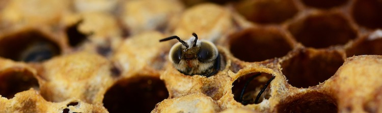

<kbd>[Return to ToC](#Table-of-Contents)</kbd>

- - -

